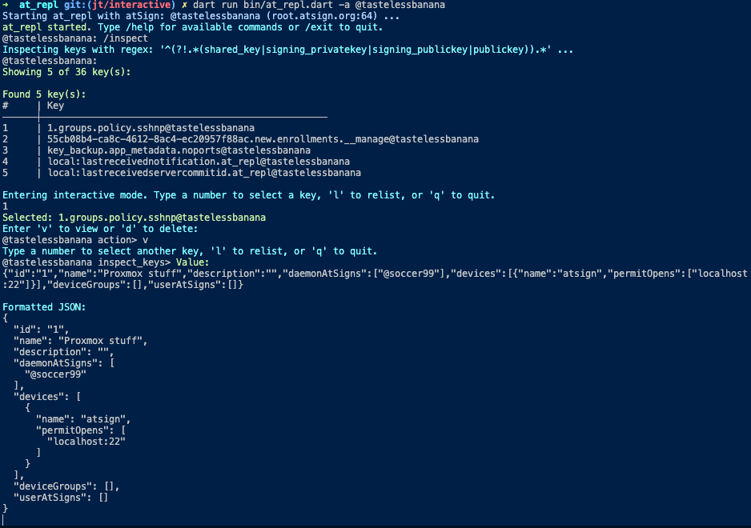

## at_repl

<a href="https://atsign.com#gh-light-mode-only"></a><a href="https://atsign.com#gh-dark-mode-only"></a>

[](https://pub.dev/packages/at_repl)
[](https://pub.dev/packages/at_repl/score)
[](./LICENSE)

A CLI tool for interacting with an atServer using the atProtocol.

### Getting Started

Ensure you have your atSign keys. Keys are usually located in `$HOME/.atsign/keys`.

If you don't have an atSign, visit here <https://my.atsign.com/login>.

If the CLI application is available on [pub](https://pub.dev), activate globally via:

```sh
dart pub global activate at_repl
```

Or locally via:

```sh
cd packages/at_repl
dart pub global activate . -s path
```

### Usage

```sh
➜ dart run bin/at_repl.dart --help
Usage: at_repl [options]

Options:
-a, --atSign          The atSign to use
    --rootUrl         The root URL to connect to
                      (defaults to "root.atsign.org:64")
-k, --keys-file       Path to the atKeys file
-v, --[no-]verbose    Enable verbose output
-h, --[no-]help       Show this help message
```

### Example Execution


